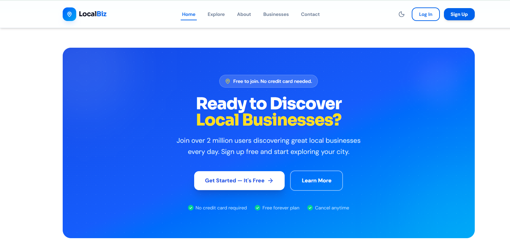
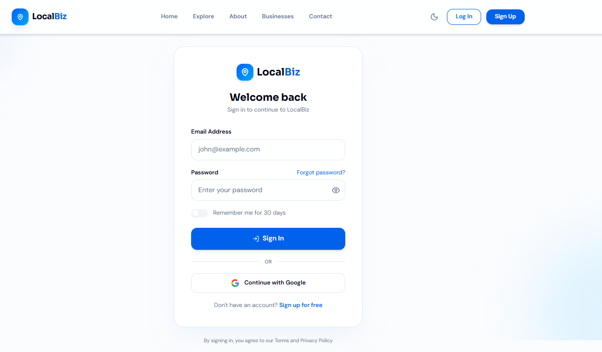
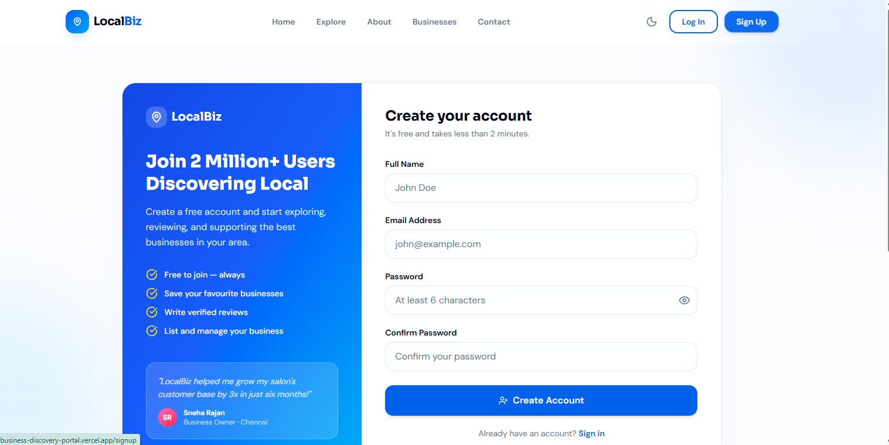
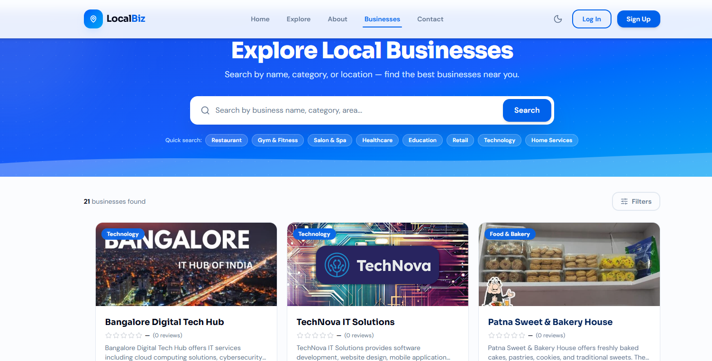
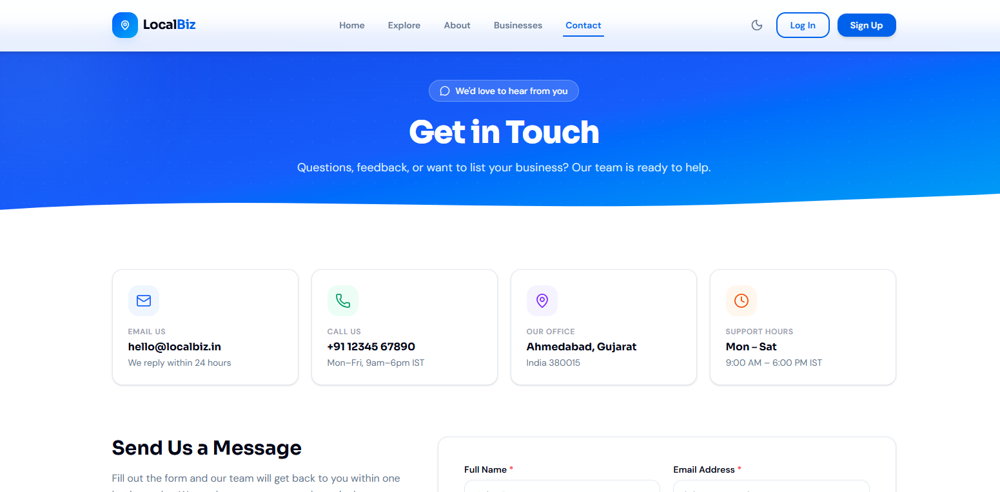

# 🌐 Local Business Discovery Portal

## 📌 Project Description
The Local Business Discovery Portal is a full-stack web application that helps users find nearby businesses such as shops, services, and vendors. It provides a platform for business owners to register and showcase their services, while users can search and explore businesses easily.

---

## 🎯 Objectives
- To connect local businesses with customers
- To provide an easy search and discovery system
- To improve visibility of small/local businesses

---

## 🚀 Features
- 🔐 User Authentication (Login / Signup)
- 📋 Business Listing
- 🔍 Search & Filter Functionality
- 📞 Contact Page
- 🗺️ Map Integration (if added)
- 📱 Responsive UI

---

## 🛠️ Tech Stack
- Frontend: Next.js (React)
- Backend: Node.js
- Database: (MongoDB / MySQL - update yours)
- Styling: CSS / Tailwind

---

## ⚙️ Installation & Setup

1. Clone the repository:
```bash
git clone https://github.com/Simran-Kumari123/local-business-discovery-portal.git
```

2. Navigate to project folder:
```bash
cd local-business-discovery-portal
```

3. Install dependencies:
```bash
npm install
```

4. Run the project:
```bash
npm run dev
```

5. Open browser:
```
http://localhost:3000
```

---

## 📸 Project Screenshots

### 🏠 Home Page
Displays the main landing page where users can explore the platform.


---

### 🔐 Login Page
Allows users to securely log into the system.


---

### 📝 Signup Page
New users can register and create an account.


---

### 📋 Business Listing
Shows all available local businesses with details.


---

### 📞 Contact Page
Users can contact or inquire about services.


---

## 📈 Future Scope
- Add reviews and ratings
- Integrate payment system
- AI-based recommendations
- Mobile application version

---

## 👨‍💻 Author
Simran Kumari

---

## 📜 License
This project is for academic purposes.
